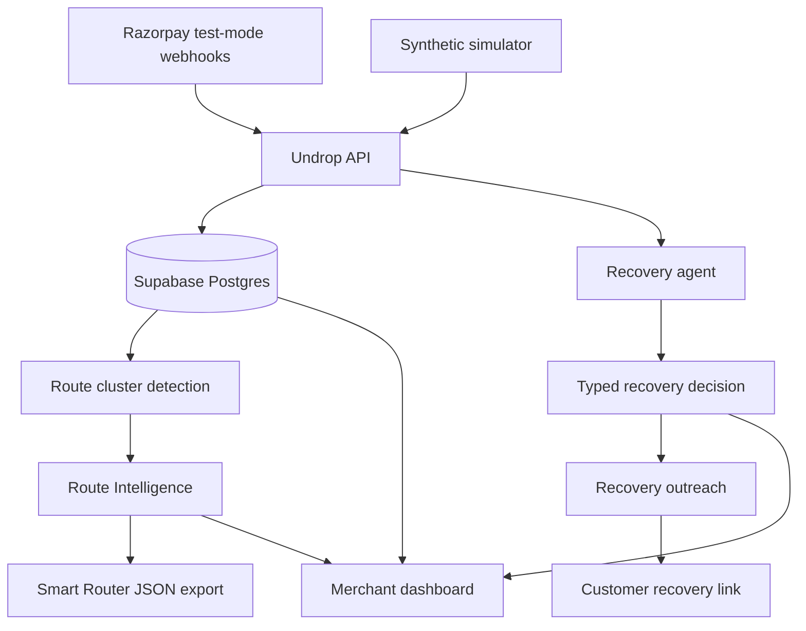

# Undrop

**Agentic revenue recovery for Razorpay merchants.**

Undrop helps merchants recover failed payments and detect route-level payment issues before they keep leaking GMV. It combines a transaction recovery agent, customer outreach workflows, live failure clustering, and Smart Router-ready recommendations in one operator console.

Built for the **Razorpay AI Buildathon 2026** under **Track 03: AI Revenue Recovery**.

## Why Undrop

Failed payments are not always lost payments.

In India, a large share of digital payment failures come from recoverable causes: insufficient balance, authentication errors, limit breaches, issuer downtime, gateway degradation, and transient route failures. Most systems treat these failures as isolated events. Undrop treats every failed transaction as both:

1. a recoverable revenue opportunity, and
2. a signal about payment route health.

That lets merchants recover individual failed payments while also finding the corridors where failures are clustering.

## What It Does

Undrop closes the revenue recovery loop:

1. **Capture failed payments** - Razorpay test-mode webhooks ingest `payment.failed` and `payment.captured` events.
2. **Diagnose the failure** - The recovery agent analyzes amount, issuer, method, decline code, and reason.
3. **Choose a bounded action** - Decisions include `retry_now`, `retry_delayed`, `suggest_alt_method`, and `escalate_human`.
4. **Draft customer outreach** - The system generates channel-aware recovery messages.
5. **Track recovery outcomes** - The dashboard reports recovered GMV, recovery rate, outreach performance, and operational savings.
6. **Detect route degradation** - Failure clusters are grouped by issuer, method, and error code.
7. **Export Smart Router rules** - Active route clusters become Razorpay Smart Router-style JSON rules.

## Buildathon Track Fit

Razorpay's **AI Revenue Recovery** track asks builders to detect revenue at risk, determine the right intervention, execute a bounded recovery workflow, show measured money recovered, include compliant escalation and stopping rules, and expose an audit trail.

Undrop directly targets that problem. It is not a generic chatbot or blind retry system. The AI layer recommends recovery actions, while the product keeps the workflow bounded, observable, and merchant-controlled.

## Core Product Surfaces

| Surface | Purpose |
| --- | --- |
| Landing page | Explains the recovery and route-intelligence story |
| Dashboard | Shows failed payments, agent decisions, recovered GMV, and Pulse Ledger metrics |
| Transaction detail | Displays decline reason, AI decision, recovery message, and trace |
| Route Intelligence | Detects issuer/method/error-code clusters above baseline |
| Smart Router export | Generates route-fix JSON from active clusters |
| Reports | Shows recovered GMV, channel performance, and routes fixed |
| Settings | Stores Razorpay and outreach configuration |
| Recovery page | Customer-facing payment recovery link |

## Architecture



## AI Design

The AI agent is used for structured decision support, not unbounded execution. For each failed transaction, it returns a decline explanation, recovery decision, optional retry delay, optional alternate method, confidence score, reasoning, and drafted outreach message.

When AI provider keys are unavailable, Undrop falls back to a deterministic rule-based decision engine so the demo remains reproducible.

## Real vs Simulated

| Component | Status |
| --- | --- |
| Razorpay webhook listener | Real: accepts `payment.failed` and `payment.captured` |
| Razorpay merchant settings | Real: stores encrypted test-mode credentials |
| Google OAuth | Real when environment variables are configured |
| Supabase persistence | Real schema with transaction, action, message, and route tables |
| AI recovery decisions | Real with Groq or Cerebras keys, deterministic fallback otherwise |
| Outreach dispatch | Real provider integrations where keys are configured, graceful fallback otherwise |
| Synthetic simulator | Simulated Buildathon data for repeatable demos |
| Dashboard seed data | Simulated merchant, issuer, method, and decline distribution |
| Route clusters | Simulated and detected from generated failure corridors |

## Tech Stack

- **Framework:** Next.js 14, App Router, TypeScript
- **UI:** Tailwind CSS, Framer Motion, Recharts
- **Auth:** Auth.js v5 with Google OAuth and demo account fallback
- **Database:** Supabase Postgres with schema in `supabase/schema.sql`
- **AI:** Groq primary, Cerebras fallback, deterministic rules as backup
- **Payments:** Razorpay test-mode webhook ingestion
- **Outreach:** Email, SMS, WhatsApp, Telegram, and webhook dispatch paths

## Getting Started

```bash
npm install
cp .env.example .env.local
npm run dev
```

Open:

```text
http://localhost:3000
```

Without OAuth configured, use **Continue with Demo Account** on the sign-in page.

## Razorpay Webhook

For a deployed demo, point the Razorpay test-mode webhook to:

```text
POST https://your-domain.com/api/webhooks/razorpay
```

Recommended events:

```text
payment.failed
payment.captured
```

If `RAZORPAY_WEBHOOK_SECRET` is configured, Undrop verifies the `x-razorpay-signature` header using HMAC SHA-256.

## Synthetic Simulator

Generate failed-payment demo data:

```bash
curl -X POST http://localhost:3000/api/simulator \
  -H "Content-Type: application/json" \
  -d '{"count": 5, "injectCluster": true}'
```

The simulator creates realistic failed transactions and can inject a high-failure HDFC UPI Intent corridor so Route Intelligence has a visible incident to detect.

## Smart Router Export

Undrop can export active route clusters as Smart Router-style JSON:

```text
POST /api/routes/export
```

The generated config includes route conditions, reroute actions, alternate-method suggestions, timestamps, and generator metadata.

## Demo Script

Use this flow for a 5-minute Buildathon demo:

1. **Landing page** - show the premise: failed payments are recoverable revenue, not just errors.
2. **Dashboard** - show recovered GMV, recovery rate, recent failed payments, and the Pulse Ledger.
3. **Simulate failures** - run the simulator with `injectCluster: true`.
4. **Transaction detail** - show the AI decision, reasoning, confidence, and recovery message.
5. **Recovery link** - open the customer-facing recovery URL.
6. **Route Intelligence** - show the HDFC UPI Intent degradation cluster and recommended route fix.
7. **Smart Router export** - export the generated route rule JSON.
8. **Reports** - close with recovered GMV, channel performance, and route fixes.

## Pitch

> Undrop helps Razorpay merchants recover revenue at two levels: it acts on individual failed payments and learns from failure patterns to recommend route fixes. The result is not just smarter retries, but a closed-loop revenue recovery system with auditability, outreach, and route intelligence built in.

## Repository Structure

```text
src/app                 Next.js App Router pages and API routes
src/components          Dashboard, landing, route, transaction, and UI components
src/lib                 Agent logic, Supabase client, auth, outreach, and data access
src/types               Shared TypeScript types
supabase/schema.sql     Database schema
scripts                 Acceptance and utility scripts
public                  Static assets
```

## Deployment

Recommended production-style deployment:

- Vercel for the Next.js app
- Supabase for Postgres
- Razorpay test-mode webhooks for payment events
- Groq or Cerebras API key for AI decisions
- Optional outreach providers for live dispatch

Set the same environment variables from `.env.example` in your deployment platform.

## Buildathon Evaluation Notes

Undrop is designed to show a real fintech problem, meaningful AI usage, a working product surface, measurable recovered GMV, route-level intelligence beyond simple retries, bounded recovery actions, audit trails, and graceful fallback when external AI providers are unavailable.

The strongest demo message:

> We do not just retry payments. We recover what can be recovered, escalate what should not be automated, and turn repeated failures into route-level fixes.
